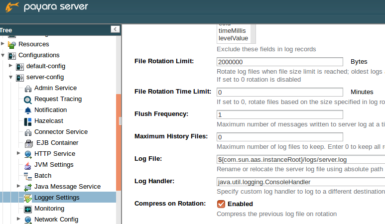
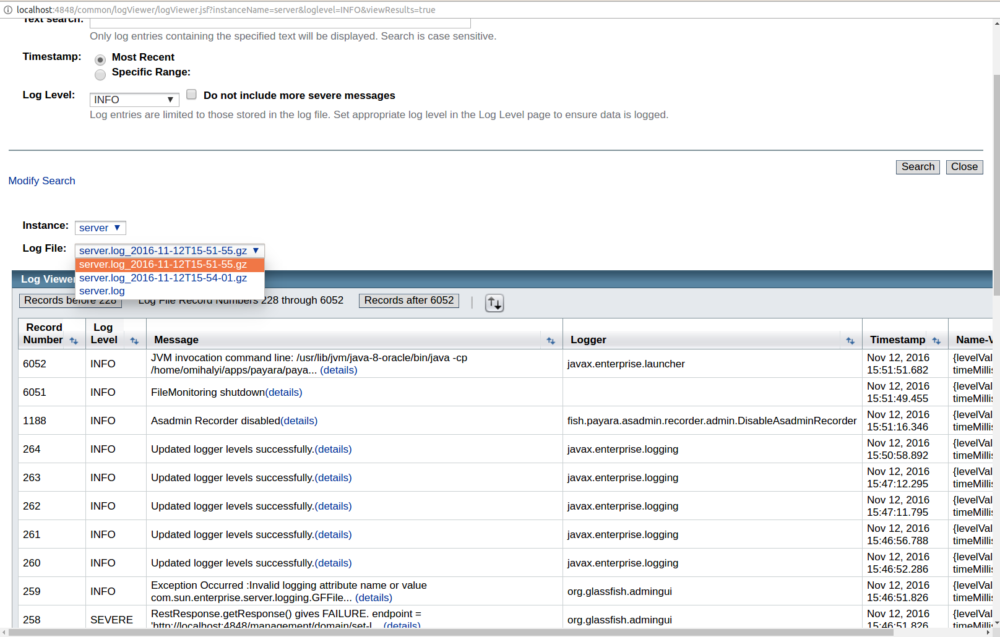

# Compression of log files on rotation

_Since version 164_

Both Payara Server and GlassFish 4.0 Open Source Edition provide option to rotate files after configurable interval (given either by the size of the log file or by time elapsed). On top of that, Payara Server can be configured to compress rotated files automatically. This is done transparently, so that it is still possible to view the log history in the log viewer in the Web Admin Console, even from compressed files.

## Using Web Admin Console

When log rotation is configured, you can turn on compression of rotated files in the `Logger Settings` section, by ticking `Compress on Rotation` checkbox:




## Using `asadmin` utility

With `asadmin` utility, the same can be achieved by setting the respective log attribute to either `true` or `false`:

```
asadmin> set-log-attributes com.sun.enterprise.server.logging.GFFileHandler.compressOnRotation='true'
```

## View the log files in the Admin Console

The log files can be viewed in Admin Console in the same way as if they were uncompressed. The only difference is that their name ends in `.gz` extension and it takes much longer to open them and display their contents.

This is an example how the Log Viewer may look like with 3 compressed log files:


